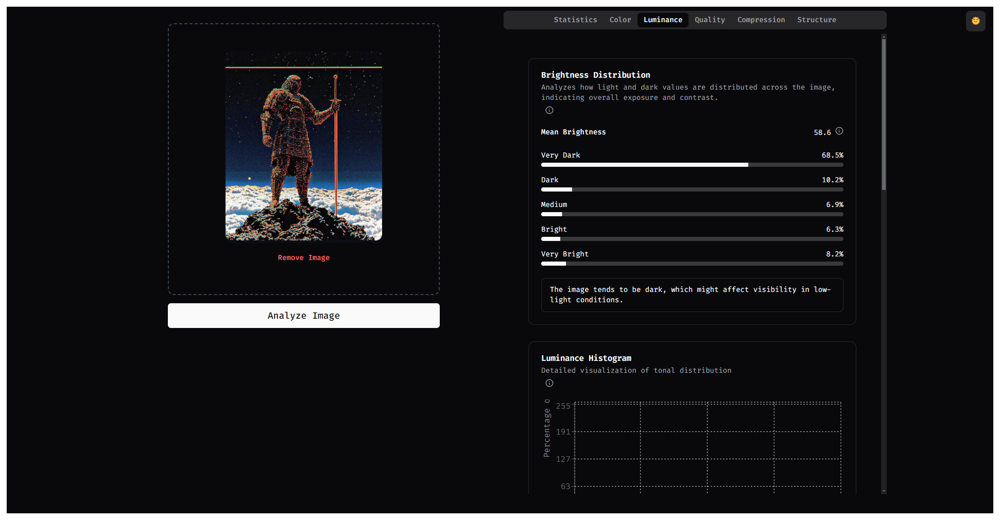
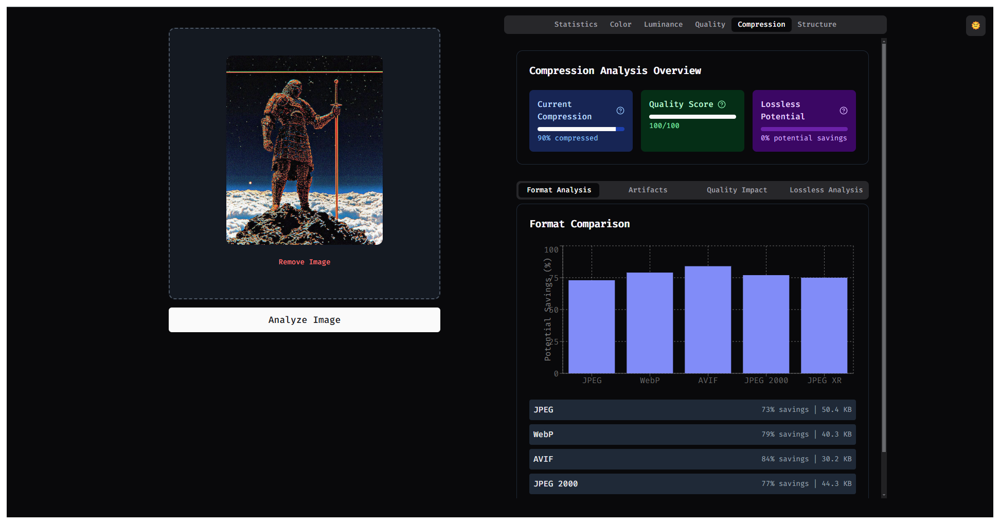
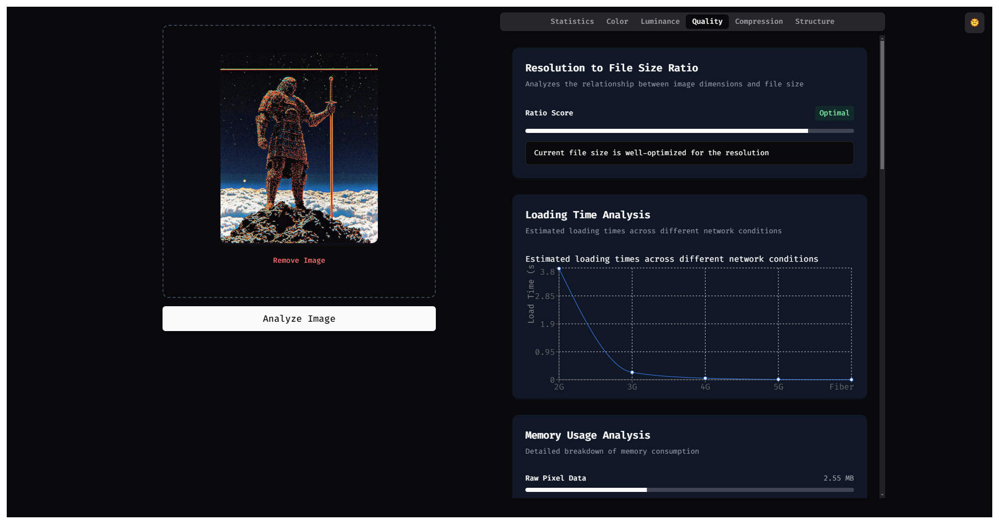

# Image Analysis Studio

A sophisticated web application for analyzing and optimizing images with detailed performance metrics, quality analysis, and compression recommendations.

## Screenshots

## 🚀 Features

### 1. Performance Analysis
- Memory usage tracking and visualization
- Bandwidth requirement calculations
- Loading time estimations
- Browser compatibility checks
- Resolution and aspect ratio analysis

### 2. Quality Metrics
- File size to resolution ratio analysis
- Loading time estimation on different network conditions
- Memory usage calculations
- Rendering impact assessment
- Network transfer size calculations

### 3. Color Analysis
- Dominant color extraction using K-means clustering
- Saturation analysis
- Web worker implementation for performance

### 4. Compression Analysis
- Format-specific optimization recommendations
- Artifact detection
- Quality impact assessment
- Lossless compression potential analysis

## 🛠️ Technology Stack

- **Frontend Framework**: React with TypeScript
- **Build Tool**: Vite
- **State Management**: Redux (with Redux Toolkit)
- **Charts**: Recharts
- **Styling**: Tailwind CSS
- **Performance**: Web Workers
- **Native Integration**: Rust (experimental)

## 🔮 Future Enhancements

1. Advanced compression algorithms
2. Batch processing capabilities
3. Export/import functionality
4. Integration with cloud storage services
5. Enhanced Rust integration for performance-critical operations